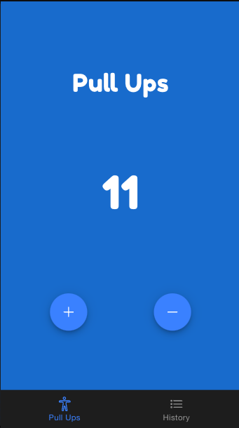
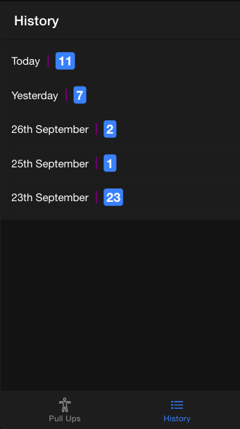

<h1 style="text-align: center;">Pull-Ups Tracker - App</h1>

Keep track of your pull-ups. ( Ionic & Angular )

  
  

If you are trying to run this app locally, you need a lower version of Node.js like v14 since most of the dependecies in the project are outdated.

